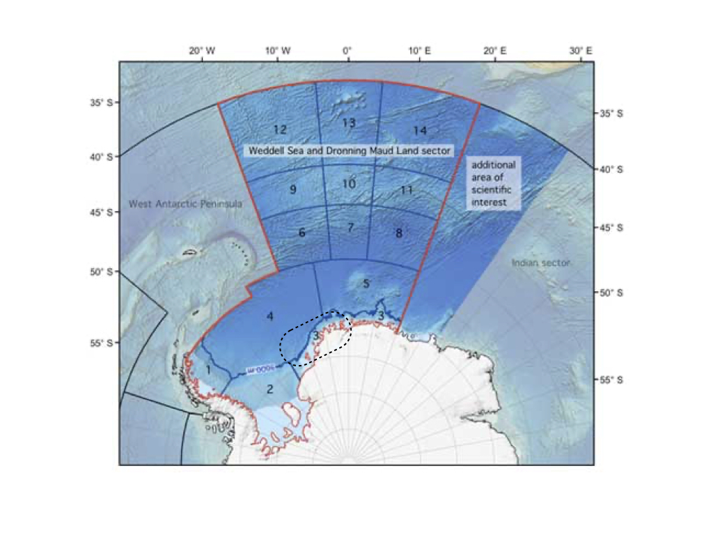
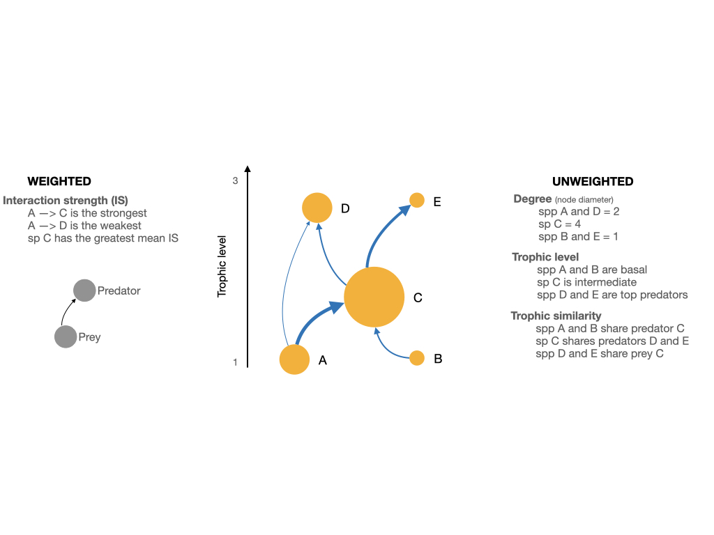
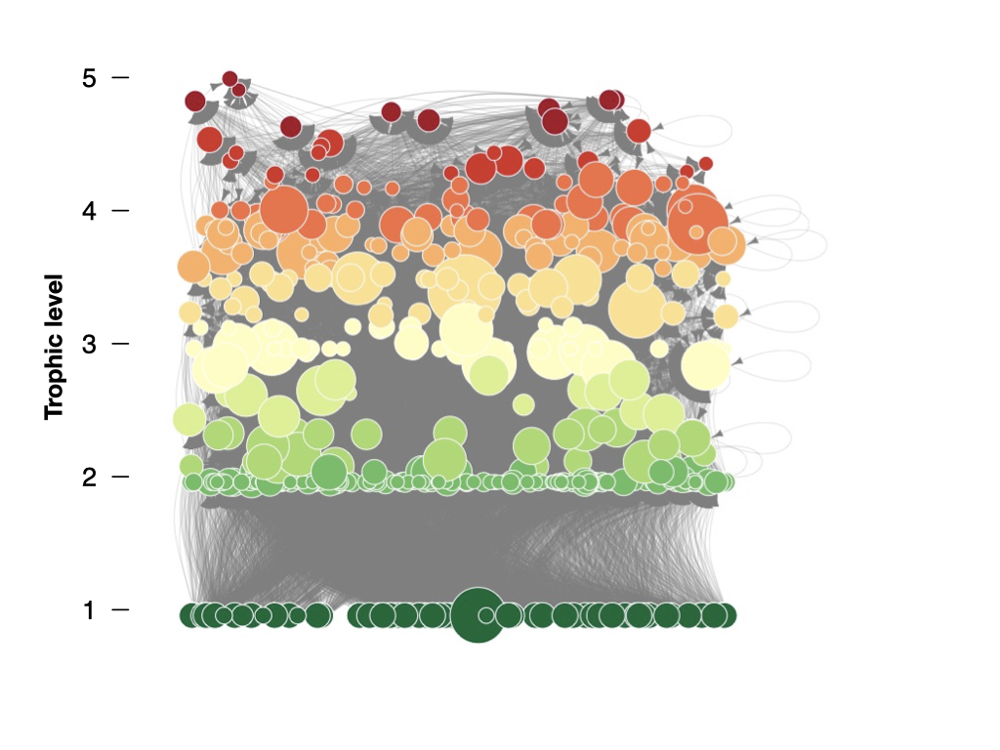

\introduction[Introduction]

Introduction text goes here.

The objective of this work was twofold: 1) estimate the strength for each interaction in the Weddell Sea food web, and 2) determine key trophic species considering weighted and unweighted properties and the influence on the stability of the network.


# Methodology

## Study area

The high Antarctic Weddell Sea shelf is situated between 74 and 78ºS with a length of approximately 450 km (Figure 1). Water depth varies from 200 to 500 m. Shallower areas are covered by continental ice, which forms the coastline along the eastern and southern part of the Weddell Sea. The shelf area contains a complex three-dimensional habitat with large biomass, intermediate to high diversity in comparison to benthic boreal communities and a spatially patchy distribution of organisms [@Dayton1990; @Teixido2002].

## Weddell Sea food web dataset

We obtained the dataset of the Weddell Sea food web from the GlobAL daTabasE of traits and food Web Architecture (GATEWAy, version 1.0) of the German Centre for Integrative Biodiversity Research (iDiv) Halle-Jena-Leipzig [@Brose2018]. This open access database is a list of predator-prey interactions that contains several highly-resolved food webs, including biological data about the consumer and resource species involved in each trophic interaction (i.e. mean mass). Furthermore, it incorporates information on the interaction itself, such as the dimensionality.

This marine food web compiles all the food web data available for the high Antarctic Weddell Sea collected since 1983, and is one of the most highly-resolved marine food webs documented to date. It's noteworthy that it is a summary network that ignores seasonal changes [@Jacob2011].

## Dataset analyses

We analysed the food web of the Weddell Sea by: a) estimating the strength of each interaction; b) studying the properties of the species in a network approach; and c) comparing the stability of the food web after performing extinction simulations.

### Interaction strength estimation and distribution

To estimate the strength of each interaction in the food web, we followed the methodology proposed by @Pawar2012. The minimum data requirements are: body mass of the consumer (predator) and resource (prey), and the interaction dimensionality classified as 2 or 3 dimensions. GATEWAy v.1.0 does provide information on the mean mass for consumers and resources (except for 'detritus' and 'sediment') for every interaction, but lacks the dimensionality for 924 interactions. To solve this issue, we used the information about movement type for consumer and resource. Then, we classified the interaction as 2D when both consumer and resource move in 2D (e.g., both are sessile or walking) or if a consumer moves in 3D and a resource in 2D (e.g., swimming consumer and sessile/walking resource). The interaction was classified as 3D when both consumer and resource move in 3D (e.g., both swimming) or if the consumer moves in 2D and resource in 3D (e.g., sessile/walking consumer, swimming resource) [@Pawar2012].

The main equation we used for estimating the interaction strength IS is:

```{=tex}
\begin{equation}
IS = \alpha x_R \frac{m_R}{m_C}
\end{equation}
```

where \vec{\alpha} is the search rate, \vec{x_R} is the density of the resource, and \vec{m_R} and \vec{m_C} are the body mass of the resource and the consumer, respectively [@Pawar2012].

We obtained estimations for the resource density and the search rate from the scaling relationships with the resource and the consumer mass, respectively (@Pawar2012). The coefficients of such relationships, determined by ordinary least squares regression, vary with the interaction dimensionality. On one hand, resource density scales with resource mass as a power-law with exponents \vec{p = -0.79 \pm 0.09} in 2D and \vec{p = -0.86 \pm 0.06} in 3D. Since mean mass for resources 'detritus' and 'sediment' were not available in GATEWAy v.1.0, we calculated it considering the scaling relationship with consumer mass, also different in 2D and 3D (for details see equation S9 and figures 2c-d of Supplementary Information in @Pawar2012). On the other hand, search rate scales with consumer mass as a power-law with exponents \vec{p = 0.68 \pm 0.12} in 2D and \vec{p = 1.05 \pm 0.08} in 3D.

Finally, we fit the distribution of the interaction strengths of the food web considering six candidate models (Uniform, Normal, Exponential, Power-law, log-Normal and Gamma) using maximum likelihood [@McCallum2008], and selected the model performance by computing the Akaike Information Criterion [@Burnham2002].

### Species properties

In order to individually characterize the species of the food web, we considered weighted and unweighted properties (Figure 2). The former is based on the estimation of the interaction strength described in the previous section. The latter is related to properties commonly used in qualitative (presence/absence of interaction) food web studies [@Martinez1991; @Dunne2002; @Borrelli2014].

As weighted property we took into account the mean interaction strength, meaning the average strength of all interactions. After exploring the distribution of the species log(mean interaction strength), we decided to apply the k-means clustering method, which aims to partition the species into k groups such that the sum of squares from points to the assigned cluster centres is minimized [@Hartigan1979]. Then we tested the goodness of this clustering measure with the Gap statistic, which compares log(W(k)) with E*[log(W(k))] where the latter is defined via bootstraping [@Tibshirani2001].

On the other hand, we considered the following unweighted properties: a) degree or the total number of trophic interactions, taking into account in- and out-interactions (role as predator and prey, respectively); b) trophic level or the position in the food web relative to primary producers/detritus; and c) trophic similarity or the trophic overlap between species based on shared and unique resources and consumers.

With the aim of studying the relationship between the interaction strength of the species and its unweighted properties, we performed linear regression analyses between the log(mean interaction strength) and each of the mentioned unweighted properties. The statistical significance of the fitted slopes was tested, as well as the difference between the groups' slopes applying least-squares means [@Harvey1960].

Formulas used to obtain the above species properties are described in Supplementary Material.

### Stability and extinction simulations

Finally, we run extinction simulations and estimated its impact on the stability of the network. For this, we calculated a stability index called Quasi-Sign Stability (QSS), which is the proportion of stable networks using randomized Jacobians and keeping the predator-prey sign structure fixed [@Allesina2008]. With the aim of analysing the effect of each species on the food web's stability, we deleted one species at a time, so the network size was reduced by one. After each species extinction, we calculated the QSS for the food web minus one species (size = 489) and compared it with the QSS for the whole network (size = 490); we performed 1000 simulations for each species. Then we statistically analysed such difference with an Anderson-Darling test [@Scholz1987].
The formula for the QSS is described in Supplementary Material.

All analyses were performed in R software, mainly using packages igraph [@Csardi2005], cheddar [@Hudson2013], and multiweb [@Saravia2019]. The source code and data are available at https://github.com/EcoComplex/WeddellSea.

# Results

## Interaction strength

In this work we have estimated the interaction strength for the most highly-resolved marine food web to date, which comprises 490 species and 16041 predator-prey interactions (Figure 3). The distribution of the interaction strength best fit to a log-Normal model, which indicates that there is a prevalent skew towards weaker interactions (Figure 4, Table 1).

## Species properties and stability

Regarding the distribution of the species mean interaction strength, the clustering method showed that species do form two distinct groups: 'High' and 'Low' interaction strength (Appendix Fig. A1). The so-called 'High IS' and 'Low IS' groups of species, exhibited different and for some cases opposite relationships with unweighted properties. It's noteworthy that only the relationship with trophic level revealed a similar trend in the regression analysis for both groups: mean interaction strength increases with trophic level (Figure 5A). On the contrary, the linear regressions with degree and trophic similarity showed opposite relationships between groups. This means that in species with relatively higher interaction strength, 'High IS', such strength decreases when the number of interactions (degree) increases; the opposite occurs in species with relatively lower interaction strength 'Low IS' (Figure 5B). Regarding trophic similarity, the interaction strength decreases in 'High IS' species while increases in 'Low IS' species (Figure 5C).

Linear regressions btw IS (weighted) and unweighted prop.
Biplots btw QSS difference and weighted and unweighted prop.


# Discussion

"Low functional redundancy at key trophic levels makes these ecosystems (polar pelagic) particularly sensitive to change". [@Murphy2016]

\clearpage
\conclusions[Conclusions]

The conclusion goes here.

\clearpage

```{r, out.width = "12cm", echo = FALSE, fig.cap = "Map of the Weddell Sea and Dronning Maud Land sector highlighting the high Antarctic shelf as a dashed-line contour. Modified from www.soos.aq."}

```

\clearpage

```{r, out.width = "12cm", echo = FALSE, fig.cap = "Scheme of a network showing the weighted and unweighted properties we used to characterize the species of the Weddell Sea food web."}

```

\clearpage

```{r, out.width = "12cm", echo = FALSE, fig.cap = "Graphic representation of the Weddell Sea food web. Species (nodes) are arranged verticaly and colored by trophic level. The diameter of the node indicates the total number of interactions. Predator-prey interactions are represented by the arrows, from the prey to the predator."}

```

\clearpage

```{r, out.width = "12cm", echo = FALSE, fig.cap = "Frequency distribution of interaction strengths for the Weddell Sea food web (n = 490)."}
knitr::include_graphics("IS_dist.jpg")
```

\clearpage

```{r, out.width = "12cm", echo = FALSE, fig.cap = "Relationships between weighted (interaction strength) and unweighted species properties. Linear regressions are shown between log(mean interaction strength) and trophic level (A), degree (B) and trophic similarity (C). All regression slopes are statistically significant as well as group's slopes (p < 0.05)."}
knitr::include_graphics("Regressions.jpg")
```

\clearpage

```{=tex}
\begin{table}[t]
\caption{Model comparison for the distribution of interaction strengths of the Weddell Sea food web. According to AIC, log-Normal is the best model.}
\begin{tabular}{l c c c}
\tophline

Model & df & AIC & deltaAIC \\
\middlehline
log-Normal & 2 & -356579 & 0 \\
\middlehline
Gamma & 2 & -352575 & 4004 \\
\middlehline
Power-law & 2 & -347646 & 8933 \\
\middlehline
Exponential & 1 & -262852 & 93726 \\
\middlehline
Normal & 2 & -222785 & 133793 \\
\middlehline
Uniform & 2 & -178001 & 178578 \\

\bottomhline
\end{tabular}
\end{table}
```

\appendixfigures
\clearpage

```{r, out.width = "12cm", echo = FALSE, fig.cap = "A) Frequency distribution for the mean interaction strength of the species of Weddell Sea food web. B) Visualization of the optimal number of clusters applying the Gap statistic."}
knitr::include_graphics("Clus_meanIS.jpg")
```
