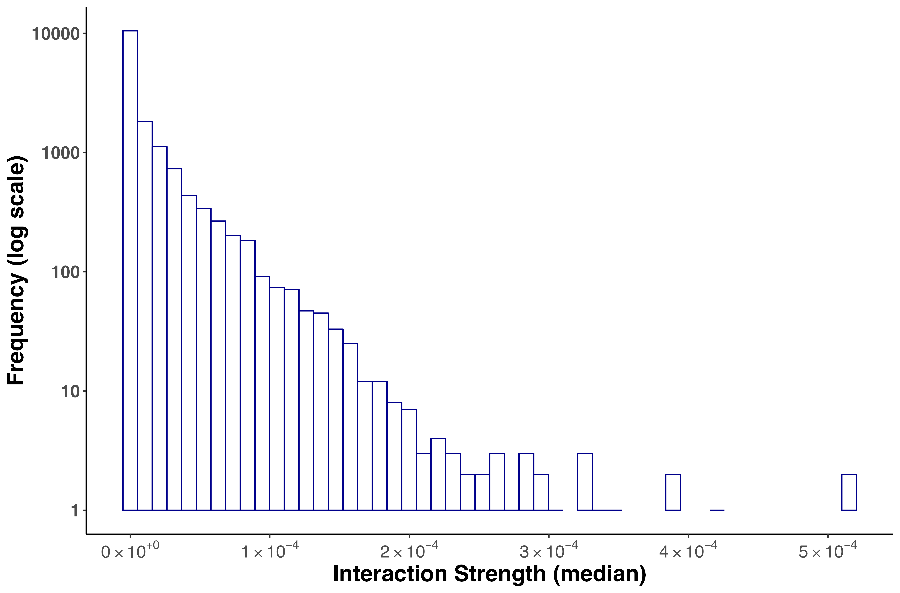
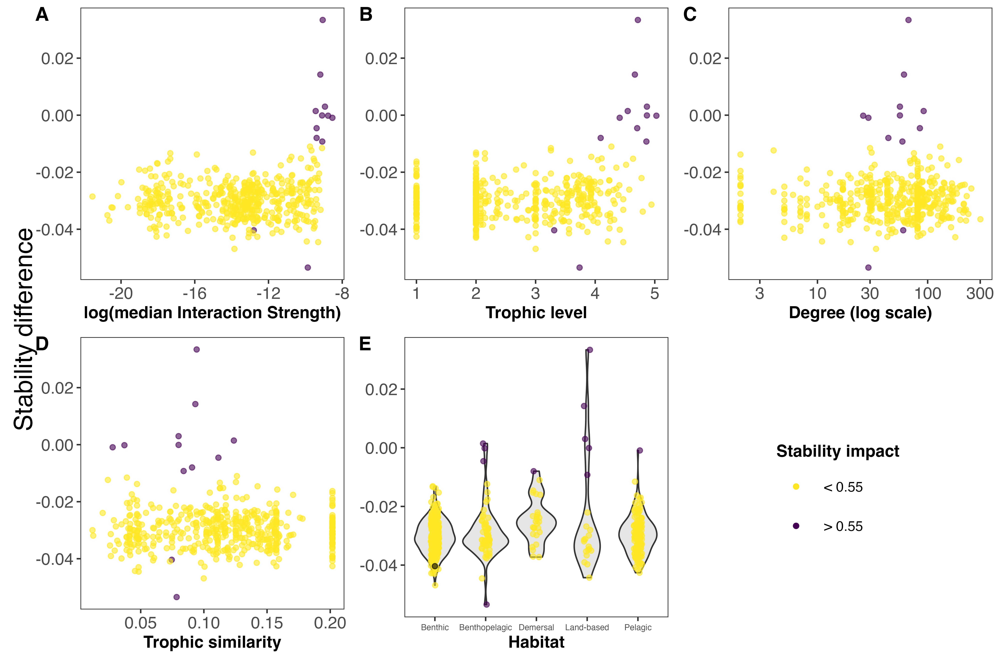

\introduction[Introduction]

Food web analysis constitutes an important framework for understanding ecological community structure and for conserving biodiversity through ecosystem management [@Thompson2012]. Although topological food web analysis, which considers only the presence and absence of predator-prey interactions, provides important insights into the structure and functioning of ecological communities [e.g. @Pascual2006; @Kortsch2015; @Marina2018; @Cordone2020; @Rodriguez2022], more information on the nature of the trophic interactions is needed to effectively characterise ecosystem dynamics and stability [e.g. @Kortsch2021; @Pecuchet2022]. This is a fundamental step for providing assessments on ecosystem vulnerability to environmental pressures and for prioritising management actions. In this regard, quantifying the strength of trophic interactions and species' roles within the network are of paramount importance [@Carrara2015; @Allesina2015; @Nilsson2016; @Cirtwill2018a].

Estimating interaction strength (IS) in food webs allows differentiating the importance of species interactions. On the contrary, unweighted food web representations give equal importance to all interactions well-knowing that some species interactions are stronger than others and hence play a different role for ecosystem functioning and stability. Both empirical and theoretical studies show that interactions strength distributions in food webs are asymmetric [@Paine1992; @McCann1998; @Emmerson2004; @Wootton2005; @Kortsch2021], containing a few strong and many weak interactions. This asymmetric patterning of weak and strong links is crucial to food web stability [@Paine1992; @McCann1998; @Neutel2002]. In a recent paper on an aquatic food web it was further highlighted that temporal changes in ecosystem functioning could only be predicted using a weighted food web structure [@Kortsch2021]. Hence, in order to assess the stability and functioning of a food web, it is important to first determine link weights.

Several methodologies have been applied to estimate IS in food webs, where the quantity and quality of the data mostly determine which approach is the most convenient [@Berlow2004]. Approaches include experimental methods combined with dynamic modelling [@Emmerson2004; @Carrara2015], measurements of species abundances through time [@Fahimipour2014; @Chang2021], and estimation of metabolic rates and biomass of all species in the community [@Neutel2014]. However, these types of methods require large experimental set-ups and parameterisations restricting the analyses to smaller networks (e.g., approximately 10 species or less). Other methods based on allometric scaling relationships and biomass information [@Kortsch2021; @Gauzens2019] can be applied to larger networks with less data requirements, but this comes at the expense of precision in the predictions. For even larger food webs composed of nearly 1000 species and more than 10000 interactions, only methods with even less data requirements are feasible. One of these methods, proposed by @Pawar2012, combines data on consumer and resource body masses and consumer search space (interaction dimensionality) to obtain IS estimates for each pairwise predator-prey interaction. An advantage of this method is that it can be applied without information on species biomass.

Diverse food webs (e.g., terrestrial, lake, marine) from various geographic locations have been studied worldwide, including marine food webs in polar regions [@Carscallen2012; @Santana2013; @Kortsch2019; @Pecuchet2022]. Studies from the Arctic show that marine food web properties (e.g., connectance and modularity) are constrained by sea ice and seawater temperature [@Kortsch2019; @Pecuchet2022]. Likewise for the Southern Ocean it was shown that sea ice has impacts on local (Ross Sea) food web structure [@Rossi2019]. For example, in the Ross Sea, sea-ice break up introduced a surge of sympagic food, which led to simpler food webs with reduced intraguild predation, potential disturbance propagation and increased vulnerability to biodiversity loss [@Rossi2019].

The Weddell Sea is expected to be one of the last regions of the Southern Ocean to experience the consequences of climate change due to its extensive sea ice cover and ocean currents [@Teschke2021] resulting in less sea surface warming compared to other areas of the Southern Ocean. Generaly, the Southern Ocean plays an important role in driving global thermohaline circulation and ventilating the global abyssal ocean because it generates a considerable part of the Antarctic Bottom Water [@Fahrbach2009]. Because of these environmental characteristics, the Weddell Sea may serve as a refuge for Antarctic species which depend on sea ice (e.g. krill, emperor penguin, Weddell seal) or have low heat tolerance (e.g., most notothenoid fishes) due to their adaptations to freezing temperatures [@Griffiths2017]. While essential large-scale hydrodynamic relationships are relatively well-known for this region [@deSteur2019], information on the current distribution, abundance and sensitivity to climate change is only partially known for a few species (e.g., emperor penguin) [@Houstin2022].

The Weddell Sea food web is highly complex, comprising 488 species and 16200 predator-prey interactions [@Jacob2011]. To better understand species roles related to food web stability, Jacob et al. (2011) performed secondary extinctions and found that the removal of small to medium-sized, and not large, organisms caused a cascade of secondary extinctions. These findings highlighted the relative importance of predators, rather than prey, for the architecture, functioning and stability of the Weddell Sea food web, which coincides with findings from recent meta-analyses in empirical complex food webs [@Brose2019; @Perkins2022]. @Brose2019 considered this food web in a meta-analysis context showing that high predator-prey body-mass ratios are found for predator groups with specific trait combinations, including small vertebrates and large swimming or flying predators. These trait combinations generate weak interactions that stabilize communities against perturbations maintaining ecosystem functioning.

In this study, we aim to go beyond a purely topological (presence/absence) assessment of who eats whom in the Weddell Sea ecosystem by providing a quantitative analysis of the trophic network structure. We aim to analyse the species' role for the structure and stability of the food web. To achieve this, we: 1) estimated the strength for each interaction, 2) characterised species' role considering both weighted and unweighted properties, and 3) analysed species’ roles related to the stability of the food web.

# Methodology

## Study area

The high Antarctic Weddell Sea shelf, our study area, is situated between 74 and 78ºS, stretching approximately 450 km from East to West (Figure 1). Water depth varies between 200 and 500 meters, and shallower areas are covered by continental ice, which forms the coastline along the eastern and southern parts of the Weddell Sea. The shelf area contains a complex three-dimensional benthic habitat with large benthic biomasses, intermediate to high diversity in comparison to benthic boreal communities and a spatially patchy distribution of organisms [@Dayton1990; @Teixido2002].

## Weddell Sea food web dataset

The Weddell Sea food web was retrieved from the GlobAL daTabasE of traits and food Web Architecture (GATEWAy, version 1.0) of the German Centre for Integrative Biodiversity Research (iDiv) Halle-Jena-Leipzig [@Brose2018]. In addition to predator-prey interactions, the database contains information on other biological data: mean body mass and length, and movement and metabolic type for each species in the food web. Furthermore, it incorporates information about the interaction itself: type (predacious, herbivorous and detritivorous) and dimension (2 or 3 dimensions according to the predator search space). In its current form, the Weddell Sea food web comprises 490 species and 16041 predator-prey interactions and thus constitutes one of the most resolved food webs constructed to date [@Jacob2011].

Complex empirical food webs are compilations of species and their potential feeding interactions within a given area and time period. The species occurrence data to construct the Weddell Sea food web was sampled between 1983 and 2005, and hence the Weddell Sea food web is representative for this time period. The diet composition for each species was observed between 2001 and 2004 through a combination of field observations and stomach content analyses (further details can be found in @Jacob2005). Some species, such as benthic grazers and suspension feeders had poor taxonomic resolution of their prey, therefore laboratory information about their size, behavior, and stable isotope signatures was used to infer their feeding habits [@Jacob2011]. As the data used to construct the Weddell Sea food web is sampled during the summer season due to the inaccessibility of ecological field sampling in Antarctica during the winter, the Weddell Sea food web is representative of the summer season.
Moreover, the species in the food web are representative of adult specimens, and were not categorized into ontogenetic life stages (i.e., larvae, juveniles, and adults). As a result, ontogenetic diet shifts cannot be addressed with this food web. The average body masses of species were either directly measured [@Jacob2005] or taken from published accounts for marine mammals and seabirds [@Brose2006a].
Due to the static nature of the Weddell Sea food web and its low temporal resolution, it is not possible to assess phenological mismatches nor species temporal turnover. Because of these methodological limitations, the nature of the Weddell Sea food web data may likely lead to overestimations of some trophic interactions and network properties (connectance), compared to realised networks at any given point in time and space.
The spatial extent of the food web is described in the Study area section (Figure 1).

## Dataset analyses

### Interaction strength estimation and distribution

To estimate the strength of each pairwise interaction in the food web, we followed an approach proposed by @Pawar2012. The minimum data requirements are body mass of the consumer (predator) and resource (prey), and the interaction dimensionality (ID) classified as 2 or 3 dimensions. The ID is defined as the search space dimensions of the predator, which is also equivalent to the movement space of the prey. Thus, the ID is classified as 2D when both predator and prey move in 2D (e.g., both are benthic) or if a predator moves in 3D and a prey in 2D (e.g., pelagic predator on benthic prey). The ID is classified as 3D when both predator and prey move in 3D (e.g., both pelagic) or if the predator moves in 2D and the prey in 3D (e.g., benthic predator, pelagic prey) [@Pawar2012].

GATEWAy v.1.0 provides information on the mean body mass for consumers and resources, except for ‘detritus’ and ‘sediment’, and the dimensionality for the majority of the interactions, though the latter is missing in some cases (924 interactions). To complete the missing data on species ‘dimensionality’, we used information about the movement type of predators and prey included in GATEWAy.

The main equation we used for estimating the interaction strength IS was:

```{=tex}
\begin{equation}
IS = \alpha x_R \frac{m_R}{m_C}
\end{equation}
```

where \vec{\alpha} is the search rate, \vec{x_R} is the resource density, and \vec{m_R} and \vec{m_C} are the body mass for the resource and the consumer, respectively [@Pawar2012].

We obtained estimates for resource density and the search rate from the scaling relationships with the resource and the consumer mass, respectively [@Pawar2012]. The coefficients of such relationships, determined by ordinary least squares regression, vary with the ID. On one hand, resource density scales with resource mass as power-law with different exponents in 2D and in 3D. Since mean mass for resources ‘phytodetritus’ and ‘sediment’ were not available in GATEWAy, we considered the body mass of the smallest phytoplankton species (‘Fragilariopsis cylindrus’) as a proxy. This is justified by the fact that ‘phytodetritus’ and ‘sediment’ are mainly composed of dead or senescent phytoplankton reaching the seabed [@Wolanski2011]. On the other hand, search rate scales with consumer mass as power-law with exponents in 2D and in 3D [@Pawar2012]. The equations for estimating the search rate and the resource density are specified in the Supplementary Material.

To quantify the variability in IS estimates, we considered the uncertainties inherent in estimating the exponents via standard linear regression. In this regard, the exponents reported in @Pawar2012 can be viewed as the mean of a normal random variable, with the standard deviation given by the associated standard errors. We generated 1000 random samples and calculated an IS value for each sample, with the final outcome of a distribution of IS estimates for each interaction. Given that the IS distributions are right-skewed and bounded below zero, we characterized the central tendency using the median IS. To represent the distribution variability, we reported the interquartile range (Supplementary Material, Figure S1). This approach accounts for the propagation of uncertainty from the exponent estimates into the derived IS values, allowing us to systematically assess the robustness of conclusions based on these interaction metrics.

We fitted the IS distribution (i.e. medians for each interaction) to six candidate models (Exponential, Gamma, log-Normal, Normal, Power-law and Uniform), using maximum likelihood [@McCallum2008], and selected the best fitting model by computing the Akaike Information Criterion AIC [@Burnham2002].

### Species properties

To characterise the role of each species in the food web, we considered unweighted and weighted food web properties (Figure 2). Unweighted properties are related to properties commonly used in qualitative food web studies and only describe the presence or absence of interactions without any information on link strength [@Martinez1991; @Dunne2002; @Borrelli2014]. In contrast, weighted properties capture the importance of a trophic interaction by considering its strength.

To assess species roles as a function of the weighted food web, we focused on mean IS defined as the average strength of all interactions for a given species. Further, we calculated three unweighted species properties: a) species degree, i.e., the sum of in- and out-going interactions ; b) trophic level ; and c) trophic similarity, i.e., the trophic overlap based on shared and unique resources and consumers. These metrics were chosen to assess species’ roles based on the unweighted network. The species degree has often been linked to a species importance for the structure and functioning within a food web, i.e. perturbations to high-degree species may therefore have more significant effects on the food web robustness than low-degree species [@Dunne2002a; references in @Cirtwill2018a]. The trophic level offers information about a species vertical position in the food web, and top predators at higher trophic levels and primary producers at the base are particularly important for food web dynamics through top-down and bottom-up control [references in @Cirtwill2018a]. Trophic similarity is an index of trophic overlap considering the set of prey and predators for a pair of species; it measures one of the most important aspects of a species’ niches, the trophic niche [@Martinez1991; @Williams2000].

Furthermore, we took species habitat affiliation into account, which describes the physical position of a species within the ecosystem. Species were categorised as: 1) benthic, if it lives on the seafloor; 2) pelagic, if it lives close to the surface; 3) benthopelagic, if it moves between and connects the aforementioned environments; 4) demersal, if it lives and feeds on, or near, the bottom of the sea; and 5) land-based, if the consumer is not strictly aquatic but feeds predominantly on marine species. Species habitat affiliations were retrieved from @Jacob2011.

To study the relationship between species mean IS (weighted property) and the unweighted species properties, we performed linear regression analyses between the log mean IS and each of the aforementioned unweighted properties. Thus, we considered the IS as the dependent variable and the given unweighted property as the independent variable, and obtained the coefficients (slope and intercept) for the linear model. Models were fitted using the least squares approach. We also explored the mean IS distribution with the species' habitat.

Formulas used to obtain the above species properties are described in Supplementary Material.

### Extinction simulations and stability

To analyse the impact of species on food web stability, we performed extinction simulations deleting one species at a time, that is for every extinction, network size was reduced by one species only. After each extinction, we calculated the stability of the network minus the removed species (489 nodes) and compared it with that of the whole network (490 nodes in total).

To estimate stability, we utilized the mean of the real part of the maximum eigenvalue of the Jacobian (or community) matrix, employing random values for the elements of the Jacobian while preserving the predator-prey sign structure [@Saravia2022; @Allesina2008; @Pawar2009]. The Jacobian matrix, denoted as $C$, is fundamental to understanding the population dynamics and inter-species interactions within an ecological network. Each element $c_{ij}$ of $C$ represents the effect of a change in the $j^{th}$ species’ density on the $i^{th}$ species, at equilibrium. When $i$ equals $j$, $c_{ij}$ reflects the dependence of the $i^{th}$ species on its own density, offering insights into intra-species interactions and self-regulation. The maximum eigenvalue describes the rate at which a small disturbance decays or amplifies over time in the vicinity of an equilibrium. Precisely, the real parts of the eigenvalues indicate the rate of exponential growth (if positive) or decay (if negative) of perturbations. Thus, a more negative index is indicative of a more stable food web with reduced probability of perturbation amplification; in other words the network is more resilient to disturbances.

We conducted 1000 simulations for the removal of each species, calculating the maximum eigenvalue for the network in each case. For each simulation, we compared this value against the median maximum eigenvalue obtained from 1000 simulations of the complete network, thus generating a distribution of differences. A positive difference indicates that the food web's stability is greater without the targeted species, suggesting that the species in question contributes to the network's instability. Conversely, a negative difference implies that the network is less stable without the species, indicating a stabilizing effect. Due to the variability in the estimation of the eigenvalues, we decided to consider that a substantial impact on stability was reached when the proportion of either negative or positive differences within this distribution exceeded 0.55, meaning that 55% of the time the difference in stability was positive or negative. A detailed description of the stability calculations can be found in the Supplementary Material (Figure S2).

To identify the species with the highest effect on food web stability and their characteristics, we plotted the results of each species' extinction and its effect on food web stability (i.e., the stability difference between the whole network and the network minus one species) against weighted (interaction strength), and the three unweighted properties (trophic level, degree, and trophic similarity), and species habitat affiliation.

All analyses were performed in R software, using the R packages igraph [@Csardi2005], cheddar [@Hudson2013], and multiweb [@Saravia2019]. The source code and data are available at https://github.com/EcoComplex/WeddellSea.

# Results

## Interaction strength distribution

The statistical distribution that best fitted the empirical interaction strength distribution of the Weddell Sea food web was a ‘log-Normal’ due to the high proportion of weak interactions and the existence of a few strong interactions (Figure 3, Table S3).

Here it is important to note that we observed an important variability when estimating each IS. The interactions that showed the greatest variability, represented by a wide interquartile range, were those where consumer and resource body masses were very small (approximately $1 x 10 ^{-15}$ kg). The frequency distribution of the interquartile range is presented in the Supplementary Material (Figure S1).

## Species’ role related to their mean interaction strength

We found that the species’ mean IS (weighted property) shows different relationships with the unweighted properties analysed (Figure 4A-D). In this regard, there is a positive relationship between IS and trophic level, i.e., the higher the trophic level of the species, the higher its mean IS. We also found a significant but less evident positive relationship with species degree. Contrary, there was no significant relationship between mean IS and trophic similarity. Considering species habitat affiliation, the “Benthopelagic” and “Pelagic” categories contained the two species with the highest mean IS, the Orca Orcinus orca and the Colossal Squid Mesonychoteuthis hamiltoni, respectively. However, the majority of the species with relatively higher IS belonged to the “Demersal” and “Land-based” habitats groups. Species inhabiting the benthic realm showed the lowest mean IS (Figure 4D).

## Species impact on food web stability

Our extinction analyses showed that the majority of species had no significant impact on food web stability after being removed (Figure 5). Most of the species (yellow points in Figure 5) did not change the stability of the network considerably after being removed, except for a few species (purple points in Figure 5). Only 12 out of 490 species (2.45%) gave rise to substantial changes in the food web’s stability after their removal (Table 1). Network stability increased after the removal of most of these species, i.e., these species have a negative effect on stability. Only two species significantly decreased network stability after being removed, the minke whale Balaenoptera acutorostrata and the sea urchin Aporocidaris milleri. These two species have a positive effect on network stability.

After exploring the stability difference against the species properties (Figure 5), we found that the species that generated a substantial impact on the stability of the food web were characterised by: 1) high mean IS; 2) mid to high trophic levels (TL > 3.3); 3) relatively high number of interactions (Degree > 25); and 4) mid to low trophic similarity (TS < 0.13). Habitat wise, species with a significant impact on stability were present in all habitats. Table 1 shows the results for the species with highest impact on the food web stability.

# Discussion

## Many weak and a few strong interactions

Our analyses show that the distribution of species IS at the network level is asymmetric, i.e., the Weddell Sea food web contains many weak interactions and only a few strong ones. This finding is consistent with many previous theoretical and empirical studies [e.g. @McCann1998; @Neutel2002; @Emmerson2004; @Wootton2005; @Kortsch2021]. The asymmetric distribution of IS in food webs has been interpreted as an explanation for the persistence of complex communities in nature [@Bascompte2005; @Allesina2015; @Nilsson2016]. Here we show that this pattern is also prevalent in the Weddell Sea, one of the most complex food webs to date, comprising 490 species and 16041 predator-prey interactions. This finding validates the method we used.

## Species’s role related to their mean interaction strength

We employed a range of descriptors using both unweighted and weighted food web properties to characterise the dynamic and multifaceted nature of the Weddell Sea food web. Our results show a positive relationship between IS and trophic level, and between IS and species degree. In the Weddell Sea, species with high degree also tend to have high mean ISs. This positive relationship between IS and species degree reinforces the central role of species with many interactions: species with a high degree (hubs) have a large impact on overall food web structure and functioning [@Dunne2002a; @Kortsch2015]. On the other hand, the positive IS-trophic level relationship contradicts studies that suggest that mid-trophic level species (e.g. krill, mesopelagic fish, squid) are involved in the major pathways of energy flow in high-latitude marine ecosystems [@Pinkerton2014; @Murphy2016; @McCormack2020; @Riccialdelli2020]. This contradiction may be explained by the lack of species biomass information in the calculation of IS in this study [@Pawar2012]. While the methodology allows information on species biomass or density to be included, this type of data was not available for the majority of species of the Weddell Sea food web. Overall, the combination of information on the quantity and quality of interactions and its relationship enabled a robust assessment of species’ roles with regard to stability.

## Species impact on food web stability

Based on our results, only a few species (2.45%) play a key role with respect to the Weddell Sea food web stability. This is in concordance with other studies on complex empirical food webs in marine polar ecosystems [@Kortsch2015; @Marina2018; @Rodriguez2022]. Here these key species are characterised by a particular set of properties: high to mean IS, mid to high trophic level, a relatively high number of interactions, and mid to low trophic similarity. In a previous study on sequential extinction simulations for the Weddell Sea food web [@Jacob2011], it was found that larger bodied-sized species could be lost without causing a collapse of the network. A caveat of this finding, also recognised by the authors, was that they did not consider the possibility of top-down extinctions or other indirect effects. In our study, we considered such top-down effects by including information on IS, which is of paramount importance when analysing the response of perturbations in ecological communities [@McCann1998; @Montoya2009; @Novak2011]. Thus, our study suggests that species with high mean IS and high trophic levels need to be considered with particular attention when trying to predict the effects of perturbations on the Weddell Sea ecosystem. This conclusion is further reinforced by the finding that these species have mid to low trophic similarity, which means that few other species of the food web can occupy the same trophic role.

The Weddell Sea ecosystem is subjected to multiple stressors triggered by global warming, of which spatial and temporal reduction in sea ice is one of the major structuring drivers in pelagic and benthic communities [@Constable2014; @Gutt2021]. The opening in the ice might bring marine mammals (seals and whales) together altering both diet and foraging behavior, as shown in the Ross Sea [@Ainley2015]. The mobile predators at high trophic levels, such as marine mammals, are the ones with the highest impact on community stability, according to our analyses. Therefore, if the Weddell Sea were to become warmer and ice-free for longer periods of time [@Turner2020], this could lead to changes in food web stability due to top-down effects, potentially resulting in trophic cascades.

## Caveats and uncertainties

One of the primary uncertainties in our analysis stems from structural variability due to, for instance, temporal changes. The Weddell Sea food web, like many high-latitude marine ecosystems, exhibits significant seasonal changes [@McMeans2015; @Rossi2019; @Kortsch2021; @Pecuchet2022]. Our study primarily focuses on data from late spring to late summer, potentially overlooking the intricacies of the winter season. Seasonal shifts can lead to variations in species interactions, trophic levels, and overall network structure. @Novotny2023 recently highlighted the importance of considering seasonal variability in food web analyses by showing distinct differences in species diet over seasons.

Another source of uncertainty stems from the parameters and data used to estimate species IS. While we accounted for variability from estimated resource density and consumer search rate [@Pawar2012], we did not consider potential variability arising from changes in species' body mass. Indeed, one could estimate the interaction strength based on body mass distributions rather than a single empirical value. Future research should consider this source of variability since it could alter food web stability outcomes [@Brose2006a; @Allesina2015; @Gross2009; @Landi2018]. Concerning body mass, the model utilized in this study exhibits sensitivity in estimating interaction strengths (IS) among species with exceedingly small body masses (approximately $1 x 10 ^{-15}$ kg), as evidenced by a broad interquartile range. Additionally, some of the observed results may stem from the fact that the applied methodology does not incorporate empirically measured biomasses for species. For example, we would have expected a relatively high impact on community stability when removing the Antarctic krill Euphausia superba, as it is one of the most important prey species in the food web based on field observations [@Atkinson2019]. Moreover, it is one of the species most affected by warming and its population has already declined as a result of productivity changes and increased access by predators [@Atkinson2004; @Kawaguchi2009]. Although our results did not show a significant impact on the stability of the Weddell Sea food web when krill went extinct, we were able to frame it as a key species in terms of its weighted and unweighted characteristics due to its high mean IS, mid trophic level and high number of interactions.

The best solution when estimating and evaluating the importance of IS in highly-resolved food webs would probably be to consider more than one methodological approach.Various methodologies have been developed to estimate species IS in food webs, for example, the conceptual framework of the food web energetics [@Gauzens2019] and the inverse model perspective [@Gellner2023]. Although we applied a particular methodology [@Pawar2012], we anticipate that a promising research endeavor would be to compare and contrast our results with those derived from alternative methodologies, which is beyond the scope of our study. Furthermore, a comprehensive review of the diverse methodologies to assign interaction strengths might provide insights into the opportunities and limitations of each approach, guiding the usefulness of each tfor addressing particular questions in future research.

\clearpage
\conclusions[Conclusions]

Our study goes beyond the current understanding of how species influence ecosystem structure and stability in polar marine ecosystems  [@Murphy2016; @McCormack2021]. The integration of weighted (IS) and unweighted network and species properties allowed us to identify which species and which species’ food web characteristics that have a destabilising or stabilising effect on the food web. This enables a more complete assessment of species’ role with respect to food web structure and stability.

We consider that the information provided in this study can be useful for the development of effective policies and management strategies, particularly given the ongoing initiative to implement a Marine Protected Area (MPA) in the Weddell Sea region [@Teschke2021].

\clearpage

```{r, out.width = "12cm", echo = FALSE, fig.cap = "Map of the Weddell Sea and Dronning Maud Land sector highlighting with a dashed-line contour the high Antarctic shelf that represents the spatial extent of the food web. Modified from www.soos.aq."}

```

\clearpage

```{r, out.width = "12cm", echo = FALSE, fig.cap = "Scheme of a network showing the weighted and unweighted properties we used to characterize the species of the Weddell Sea food web. Directed arrows indicate the flow of energy; the width of the arrow represents the interaction strength of it."}

```

\clearpage

```{r, out.width = "12cm", echo = FALSE, fig.cap = "Frequency distribution of (median) interaction strengths for the Weddell Sea food web. The distribution was best fitted to a 'log-Normal' model. Total number of interactions = 16041."}

```

\clearpage

```{r, out.width = "12cm", echo = FALSE, fig.cap = "Relationships between weighted (median Interaction Strength) and unweighted properties including habitat. Linear regressions are shown between log(median interaction strength) and trophic level (A), degree (B) and trophic similarity (C). Linear regressions for trophic level ($y = 1.23x - 15.67, R^2 = 0.46, p-value < 2.2e-16$), degree ($y = 0.006x - 12.86, R^2 = 0.03, p-value = 1.19e-4$) and trophic similarity ($y = -2.78x - 12.12, R^2 = 0.03, p-value = 0.11$)."}

```

\clearpage

```{r, out.width = "12cm", echo = FALSE, fig.cap = "Stability  difference (median maximum eingenvalue) between the whole Weddell Sea food web (n = 490) and the food web minus one species (n = 489) for weighted (interaction strength) and unweighted species properties, and habitat. Point color indicates the impact on the stability; if substantial (> 0.55 relative difference) the extinction of that species altered the stability of the food web."}

```

\clearpage

```{=tex}
\begin{table}[t]
\caption{Properties for the species with highest impact on the food web stability. Summary of maximum eigenvalue (QSS) distribution of differences before and after performing extinction simulations in the Weddell Sea food web. Ordered by decreasing proportion of positive differences. References: medianIS = median interaction strength, TL = trophic level, Deg = degree, TS = trophic similarity, Prop dif QSS + = Proportion of positive differences, Prop dif QSS - = Proportion of negative differences.}
\begin{tabular}{l c c c c c c c}
\tophline

\textbf{Species} & \textbf{medianIS} & \textbf{TL} & \textbf{Deg} & \textbf{TS} & \textbf{Habitat} & \textbf{Prop dif QSS +} & \textbf{Prop dif QSS -} \\
\middlehline
Hydrurga leptonyx & 1.162399e-04 & 4.716 & 67 & 0.09428900 & Land-based & 0.651 & 0.349 \\
\middlehline
Arctocephalus gazella & 1.021457e-04 & 4.666 & 61 & 0.09325095 & Land-based & 0.613 & 0.387 \\
\middlehline
Mirounga leonina & 1.314364e-04 & 4.868 & 56 & 0.07998706 & Land-based & 0.581 & 0.419 \\
\middlehline
Mesonychoteuthis hamiltoni & 1.966995e-04 & 4.411 & 29 & 0.02781001 & Pelagic & 0.573 & 0.427 \\
\middlehline
Orcinus orca & 1.557436e-04 & 5.027 & 26 & 0.03712293 & Benthopelagic & 0.570 & 0.430 \\
\middlehline
Macrourus holotrachys & 8.350777e-05 & 4.705 & 85 & 0.11150715 & Benthopelagic & 0.568 & 0.432 \\
\middlehline
Notothenia marmorata & 8.357614e-05 & 4.092 & 44 & 0.09065823 & Demersal & 0.563 & 0.437 \\
\middlehline
Macrourus whitsoni & 7.945909e-05 & 4.546 & 92 & 0.12372962 & Benthopelagic & 0.558 & 0.442 \\
\middlehline
Ommatophoca rossii & 1.124936e-04 & 4.868 & 56 & 0.07998706 & Land-based & 0.558 & 0.442 \\
\middlehline
Leptonychotes weddelli & 1.137129e-04 & 4.859 & 59 & 0.08397729 & Land-based & 0.551 & 0.449 \\
\middlehline
Aporocidaris milleri & 2.762191e-06 & 3.312 & 60 & 0.07457218 & Benthic & 0.447 & 0.553 \\
\middlehline
Balaenoptera acutorostrata & 5.181120e-05 & 3.738 & 29 & 0.07843173 & Benthopelagic & 0.423 & 0.577 \\
\bottomhline
\end{tabular}
\end{table} 
```

\appendixfigures
\clearpage

```{r, out.width = "12cm", echo = FALSE, fig.cap = "Graphic representation of the Weddell Sea food web. Species (nodes) are arranged vertically and colored by trophic level. The diameter of the node indicates the total number of interactions. Predator-prey interactions are represented by the arrows, from prey to predator."}
knitr::include_graphics("App1_FWplot.png")
```