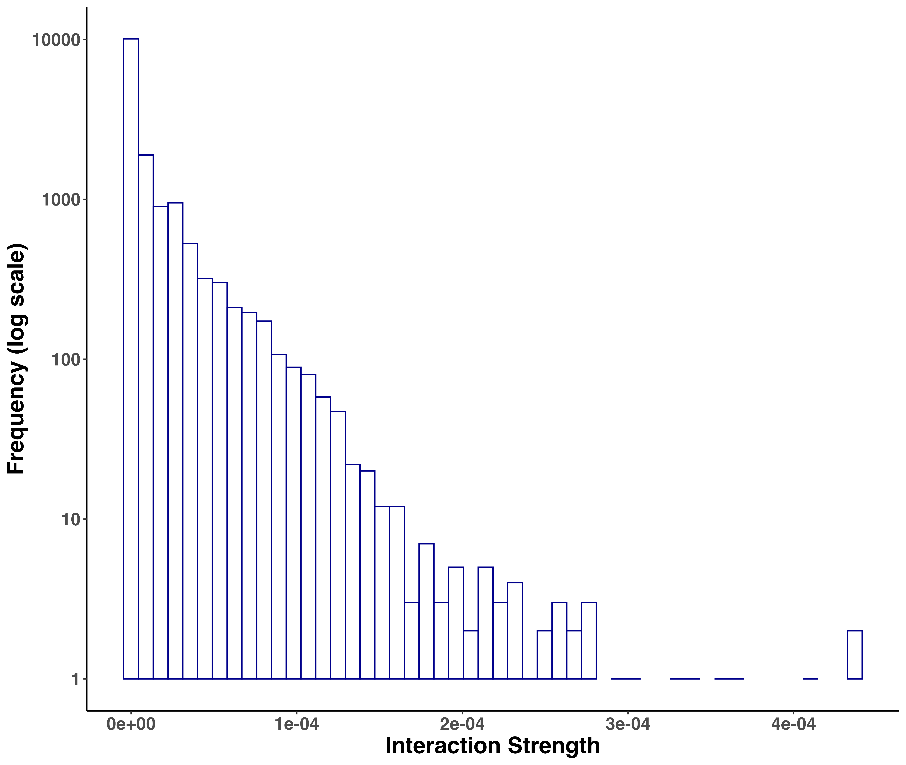
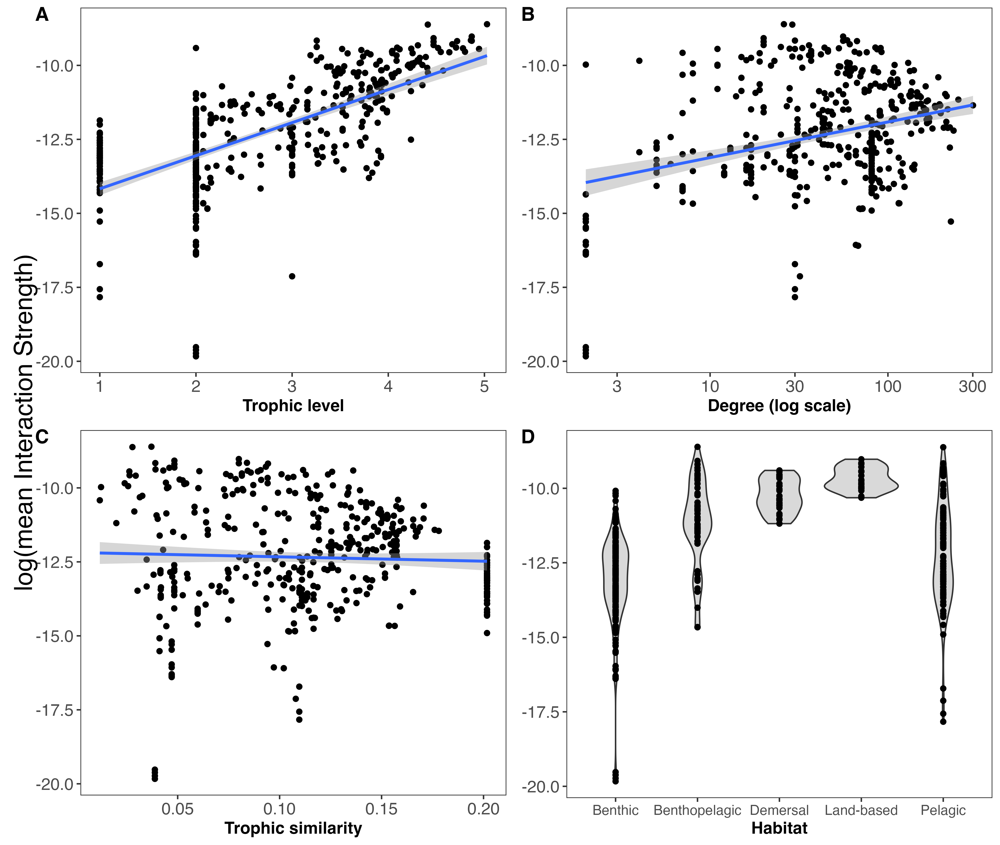

\introduction[Introduction]

Introduction text goes here.

The objective of this work was twofold: 1) estimate the strength for each interaction in the Weddell Sea food web, and 2) determine key trophic species considering weighted and unweighted properties and the influence on the stability of the network.


# Methodology

## Study area

The high Antarctic Weddell Sea shelf is situated between 74 and 78ºS with a length of approximately 450 km (Figure 1). Water depth varies from 200 to 500 m. Shallower areas are covered by continental ice, which forms the coastline along the eastern and southern part of the Weddell Sea. The shelf area contains a complex three-dimensional habitat with large biomass, intermediate to high diversity in comparison to benthic boreal communities and a spatially patchy distribution of organisms [@Dayton1990; @Teixido2002].

## Weddell Sea food web dataset

We obtained the dataset of the Weddell Sea food web from the GlobAL daTabasE of traits and food Web Architecture (GATEWAy, version 1.0) of the German Centre for Integrative Biodiversity Research (iDiv) Halle-Jena-Leipzig [@Brose2018]. This open access database is a list of predator-prey interactions that contains several highly-resolved food webs, including biological data about the consumer and resource species involved in each trophic interaction (i.e. mean mass). Furthermore, it incorporates information about the interaction itself, such as the dimensionality (2 or 3 dimensions).

This marine food web compiles all the trophic data available for the high Antarctic Weddell Sea collected since 1983, and is one of the most highly-resolved marine food webs documented to date. It's noteworthy that it is a summary network that ignores seasonal changes [@Jacob2011].

## Dataset analyses

We analysed the food web of the Weddell Sea by: a) estimating the strength of each interaction; b) studying the species properties in a network framework; and c) comparing the stability of the food web after performing species extinction in silico simulations.

### Interaction strength estimation and distribution

To estimate the strength of each interaction in the food web we followed the methodology proposed by @Pawar2012. The minimum data requirements are: body mass of the consumer (predator) and resource (prey), and the interaction dimensionality classified as 2 or 3 dimensions. GATEWAy v.1.0 does provide the mean mass for consumers and resources (except for 'detritus' and 'sediment') and the dimensionality for the majority of the interactions, though the latter is missing in some cases (924 interactions). To complete such missing data, we used information about movement type for consumer and resource included in GATEWAy. Thus, we classified the interaction as 2D if both consumer and resource move in 2D (e.g., both are sessile or walking) or if a consumer moves in 3D and a resource in 2D (e.g., swimming consumer and sessile/walking resource). The interaction was classified as 3D if both consumer and resource move in 3D (e.g., both swimming) or if the consumer moves in 2D and the resource in 3D (e.g., sessile/walking consumer, swimming resource) [@Pawar2012].

The main equation we used for estimating the interaction strength IS was:

```{=tex}
\begin{equation}
IS = \alpha x_R \frac{m_R}{m_C}
\end{equation}
```

where \vec{\alpha} is the search rate, \vec{x_R} is the resource density, and \vec{m_R} and \vec{m_C} are the body mass for the resource and the consumer, respectively [@Pawar2012].

We obtained estimations for the resource density and the search rate from the scaling relationships with the resource and the consumer mass, respectively [@Pawar2012]. The coefficients of such relationships, determined by ordinary least squares regression, vary with the interaction dimensionality. On one hand, resource density scales with resource mass as power-law with exponents \vec{p = -0.79 \pm 0.09} in 2D and \vec{p = -0.86 \pm 0.06} in 3D. Since mean mass for resources 'phytodetritus' and 'sediment' were not available in GATEWAy, we considered the body mass of the smallest phytoplankton species ('Fragilariopsis cylindrus') as a proxy. This is justified by the fact that 'phytodetritus' and 'sediment' are mainly composed by dead or senescent phytoplankton reaching the seabed (@Wolanski2011). On the other hand, search rate scales with consumer mass as power-law with exponents \vec{p = 0.68 \pm 0.12} in 2D and \vec{p = 1.05 \pm 0.08} in 3D.

Finally, we fit the interaction strength distribution of the food web considering six candidate models (Exponential, Gamma, log-Normal, Normal, Power-law and Uniform) using maximum likelihood [@McCallum2008], and selected the model performance by computing the Akaike Information Criterion AIC [@Burnham2002].

### Species properties

In order to individually characterize the species of the food web, we considered weighted and unweighted properties (Figure 2). The former is based on the estimation of the interaction strength described in the previous section. The latter is related to properties commonly used in qualitative or topological (presence/absence of interaction) food web studies [@Martinez1991; @Dunne2002; @Borrelli2014].

As the weighted property we took into account the total mean interaction strength, meaning the average strength of all species' interactions for each species. On the other hand, we considered the following unweighted properties: a) degree or the total number of trophic interactions, summing up in- and out-coming interactions (role as predator and prey, respectively); b) trophic level or the position in the food web relative to primary producers/detritus; and c) trophic similarity or the trophic overlap based on shared and unique resources and consumers. The following are arguments to have selected the unweighted properties. The degree has often been equated with importance to the structure and functioning of a community, i.e. perturbations to high-degree species may therefore have larger effects on the food web than perturbations to low-degree species [@Dunne2002a; references in @Cirtwill2018a]. The trophic level offers information about how important a species is to its biotic community, i.e. top predators and primary producers are expected to have particularly large effects on the rest of their communities through top-down and bottom-up control, respectively [references in @Cirtwill2018a]. The trophic similarity measures one of the most important aspects of species’ niches, the trophic niche, and functional aspects of biodiversity [@Martinez1991; @Williams2000].

Furthermore, we took into account the species' habitat, which describes the physical position of a species within the ecosystem. Species were categorized as: 1) benthic, if the species lives on the seafloor; 2) pelagic, if the species lives close to the surface; 3) benthopelagic, if it moves between and connects the mentioned environments; 4) demersal, if it lives and feeds on or near the bottom of the sea; and 5) land-based, if the consumer is not aquatic but feeds predominantly in the marine realm. These data was taken from @Jacob2011.

With the aim of studying the relationship between the interaction strength of the species (weighted property) and its unweighted properties we performed linear regression analyses between the log(mean interaction strength) and each of the mentioned unweighted properties. We also explored such weighted property with species habitat.

Formulas used to obtain the above species properties are described in Supplementary Material.

### Extinction simulations and stability

Finally, we run extinction simulations and estimated its impact on the stability of the food web. For this, we calculated a stability index called Quasi-Sign Stability (QSS), which is the proportion of stable networks using randomized Jacobians and keeping the predator-prey sign structure fixed [@Allesina2008]. If this proportion is zero, then one should take into account the real part of the maximum eigenvalue of the Jacobian matrix, which is also a measure of stability [@Grilli2016].

With the aim of analysing the effect of each species on the food web's stability we performed extinction simulations deleting one species at a time, so the network size was reduced by one. After each species extinction, we calculated the stability for the food web minus one species (size = 489) and compared it with that of the whole network (size = 490). We performed 1000 simulations for each species extinction and obtained a mean QSS and maximum eigenvalue. At last we statistically analysed such difference with an Anderson-Darling test considering a p-value < 0.01 [@Scholz1987]. If the difference was positive, then the stability of the food web was impacted positively (higher stability) when that species become extinct, and viceversa. Details for the stability calculations are described in Supplementary Material.

Once we had the results for the impact on stability for each species extinction, we plotted them considering weighted (interaction strength) and unweighted properties, and species habitat. With this we aim to characterize those species with a relatively high effect on the stability of the food web.

All analyses were performed in R software, mainly using packages igraph [@Csardi2005], cheddar [@Hudson2013], and multiweb [@Saravia2019]. The source code and data are available at https://github.com/EcoComplex/WeddellSea.

# Results

## Interaction strength

In this work we have estimated the interaction strength for the most highly-resolved marine food web to date, which comprises 490 species and 16041 predator-prey interactions. The distribution of the interaction strength best fit to a log-Normal model, meaning that there is a prevalent skew towards weaker interactions (Figure 3, Table 1).

## Species properties

Following the above results for the distribution of the interaction strengths, we found that the species mean interaction strength was different. We also found that such weighted property is related more or less with unweighted properties (Figure 4A-D). In this regard, interaction strength - trophic level showed a significant positive linear regression: the higher the trophic level of the species, the higher its mean interaction strength. We also found a significant but less evident positive relationship with degree or the total number of interactions. On the other hand, there was no significant relationship with trophic similarity. Considering species habitat, the "Benthopelagic" and "Pelagic" categories presented the two species with the highest mean interaction strength (Orcinus orca and Mesonychoteuthis hamiltoni, respectively), though "Demersal" and "Land-based" habitats concentrated the majority of the species with relatively higher interaction strength. Species inhabiting the benthic realm showed the lowest mean interaction strength (Figure 4D).

## Extinction simulations and stability

It's important to note that since the proportion of Jacobians that are locally stable or QSS was zero for the Weddell Sea food web, we considered the mean maximum eigenvalue as the stability index. When performing the extinction simulations, our results showed that the majority of the species had no significant impact on the stability of the food web when extinct (Figure 5). This is shown in Figure 5, where most of the points lie around the zero value of the 'Stability difference' y axis, meaning that the stability for the food web minus a given species is similar (not significant) to the stability for the whole network. However, there were few species that when become extinct altered significantly the stability of the food web. Most of such species generated positive significant differences in the stability of the food web, which mean that they increased the network's stability when deleted. There were two exceptions, Pagetopsis macropterus (demersal fish) and Maxilliphimedia longipes (benthopelagic amphipod), that when deleted decreased the stability. Overall, 15 out of 490 species (3.06%) gave rise to significant changes in the food web's stability (Table 2).

After exploring the stability difference against the species properties (Figure 5), we found that those species that generated a significant impact on the stability of the food web were characterized by: 1) high mean interaction strength; 2) mid to high trophic levels (TL > 3.2); 3) relatively high number of interactions (Degree > 25); and 4) mid to low trophic similarity (TS < 0.16). Habitat wise, species with a significant impact on the stability were present in all habitats, except for the benthic realm. Table 2 shows these results for such species.


# Discussion

Using the highest-resolved marine polar food web up to date, we show that 1) the distribution of the interaction strength at the food web level is asymmetric, where weak interactions are prevalent; that 2) there is a positive relationship between species mean interaction strength and two unweighted properties, trophic level and degree; and that 3) only few species are key in terms of food web stability, presenting particular weighted and unweighted properties. It's also noteworthy, that our study is the first of its type to consider the dimensionality of the interaction (2 or 3 dimensions) to estimate predator-prey relationships. After analysing more than 2900 predator-prey interactions from several ecosystems, @Pawar2012 concluded that interaction dimensionality is a critical factor driving consumer-resource dynamics, which will lead to better predictions of food web and ecosystem functioning. This arises as crucial to better understand how a complex system such as the Weddell Sea might respond to environmental change, which is an ongoing issue in that region of the Antarctic [@Gutt2022 and references herein].

Our results regarding the distribution of the interaction strengths are consistent with prior theoretical and empirical studies [e.g. @McCann1998; @Neutel2002; @Emmerson2004; @Wootton2005]. Within a system of a given complexity, commonly only a few strong species interactions are present with most interactions being weak. Historically, after @May1972 installed the debate complexity-stability, these results have been interpreted as an explanation for the persistence of complex food webs in nature [@Bascompte2005; @Allesina2015; @Nilsson2016]. Here we showed that this pattern is also prevalent in one of the most complex empirical marine food webs that was studied so far, with 490 species and 16041 predator-prey interactions.

Strong relationship between interaction strength and trophic level. Less stronger but evident relationship with degree


Principal results:
1) First study to
      * consider the interaction dimensionality to estimate interaction strength in a food web framework

2) Asymmetric distribution of IS at the food web level; dominance of weak interactions

3) Strong relationship between interaction strength and trophic level. Less stronger but evident relationship with degree

4) Few species are important in terms of stability: discuss species characteristics

1)
2)
Dominance of weak interactions in concordance with other studies.

Within a system of a given complexity, commonly only a few strong species interactions are present with most interactions being weak (e.g. Bascompte et al., 2005; Berlow et al., 2004; Paine, 1992; Wootton & Emmerson, 2005), though still being important for system stability (e.g. Kadoya et al., 2018; McCann et al., 1998; O'Gorman & Emmerson, 2009). Moreover, there is some evidence indicating that generalists (i.e. species with many possible interacting partners) mostly have weak interactions, while specialist species (i.e. fewer possible interacting partners) show stronger interactions (Wootton & Stouffer, 2016).

3)

4)
Our results showed that only few species are key in terms of stability in the Weddell Sea food web. This is in concordance with other studies of complex empirical food webs in high-latitude marine ecosystems [@Kortsch2015; @Marina2018; @Rodriguez2022]. In the present work we propose that such key species are characterized by: 1) high mean interaction strength; 2) mid to high trophic level; 3) relatively high number of interactions; and 4) mid to low trophic similarity.

Our results contradict studies suggesting that mid-trophic level species are key in marine polar ecosystems.

The trophic similarity index might be interpreted as a proxy for the functional redundancy of the food web. In this sense, ...
Low functional redundancy at key trophic levels makes these ecosystems (polar pelagic) particularly sensitive to change. [@Murphy2016]


\clearpage
\conclusions[Conclusions]

Our analyses provide insights into ...

\clearpage

```{r, out.width = "12cm", echo = FALSE, fig.cap = "Map of the Weddell Sea and Dronning Maud Land sector highlighting the high Antarctic shelf as a dashed-line contour. Modified from www.soos.aq."}
knitr::include_graphics("Fig.1_StudyMap.jpg")
```

\clearpage

```{r, out.width = "12cm", echo = FALSE, fig.cap = "Scheme of a network showing the weighted and unweighted properties we used to characterize the species of the Weddell Sea food web."}
knitr::include_graphics("Fig.2_ToyFoodWeb.jpg")
```

\clearpage

```{r, out.width = "12cm", echo = FALSE, fig.cap = "Frequency distribution of interaction strengths for the Weddell Sea food web. Total number of interactions = 16041."}

```

\clearpage

```{r, out.width = "12cm", echo = FALSE, fig.cap = "Relationships between weighted (mean Interaction Strength) and unweighted properties including habitat. Linear regressions are shown between log(mean interaction strength) and trophic level (A), degree (B) and trophic similarity (C). Linear regressions for trophic level ($y = 1.12x - 15.29, R^2 = 0.43, p-value < 2e-16$), degree ($y = 0.006x - 12.77, R^2 = 0.03, p-value = 4.06e-5$) and trophic similarity ($y = -1.46x - 12.18, R^2 = -0.0004, p-value = 0.36$)."}

```

\clearpage

```{r, out.width = "12cm", echo = FALSE, fig.cap = "Quasi-Sign Stability (QSS) difference between the whole Weddell Sea food web (n = 490) and the food web without one species (n = 489) for weighted (interaction strength) and unweighted species properties, and habitat. Point color indicates the impact on the QSS; if significant the extinction of that species altered the stability (QSS) of the food web."}
knitr::include_graphics("Fig.5_QSSDif.png")
```

\clearpage

```{=tex}
\begin{table}[t]
\caption{Model comparison for the distribution of interaction strengths of the Weddell Sea food web. Order by best fit. References: df = degrees of freedom, AIC = Akaike Information Criterion, deltaAIC = difference with best fit. Log-Normal is the best model.}
\begin{tabular}{l c c c}
\tophline

\textbf{Model} & \textbf{df} & \textbf{AIC} & \textbf{deltaAIC} \\
\middlehline
log-Normal & 2 & -359738 & 0 \\
\middlehline
Gamma & 2 & -359714.1 & 23.89 \\
\middlehline
Power-law & 2 & -350667 & 9070.97 \\
\middlehline
Exponential & 1 & -327606.5 & 32131.54 \\
\middlehline
Normal & 2 & -291407.8 & 68330.21 \\
\middlehline
Uniform & 2 & -248179 & 111559.02 \\

\bottomhline
\end{tabular}
\end{table}
```

\clearpage

```{=tex}
\begin{table}[t]
\caption{Properties of the species that when become extinct generated a significant impact on the stability of the Weddell Sea food web, ordered by significance (Anderson-Darling p-value). References: meanIS = mean interaction strength, TL = trophic level, Deg = degree, TS = trophic similarity, StabDif = stability difference, ADvalue = Anderson-Darling p-value.}
\begin{tabular}{l c c c c c c c}
\tophline

\textbf{Species} & \textbf{meanIS} & \textbf{TL} & \textbf{Deg} & \textbf{TS} & \textbf{Habitat} & \textbf{StabDif} & \textbf{ADvalue}\\
\middlehline
Orcinus orca & 1.83e-4 & 5.03 & 26 & 0.037 & Benthopelagic & 4.67e-5 & 2.28e-41 \\
\middlehline
Macrourus holotrachys & 8.30e-5 & 4.70 & 85 & 0.112 & Benthopelagic & 3.55e-5 & 2.73e-23 \\
\middlehline
Pagetopsis macropterus & 7.08e-5 & 4.64 & 76 & 0.113 & Demersal & -1.80e-5 & 2.38e-12 \\
\middlehline
Abyssorchomene nodimanus & 2.56e-5 & 4.21 & 137 & 0.130 & Benthopelagic & 2.30e-5 & 8.52e-10 \\
\middlehline
Dissostichus mawsoni & 7.82e-5 & 4.12 & 87 & 0.126 & Pelagic & 2.17e-5 & 1.57e-9 \\
\middlehline
Macrourus whitsoni & 7.14e-5 & 4.55 & 92 & 0.124 & Benthopelagic & 2.12e-5 & 3.30e-8 \\
\middlehline
Hydrurga leptonyx & 1.03e-4 & 4.72 & 67 & 0.094 & Land-based & 2.04e-5 & 9.66e-6 \\
\middlehline
Mesonychoteuthis hamiltoni & 1.80e-4 & 4.41 & 29 & 0.028 & Pelagic & 1.82e-5 & 4.59e-5 \\
\middlehline
Champsocephalus gunnari & 7.62e-5 & 3.72 & 46 & 0.086 & Pelagic & 1.83e-5 & 6.79e-5 \\
\middlehline
Notothenia marmorata & 8.27e-5 & 4.09 & 44 & 0.091 & Demersal & 1.60e-5 & 1.23e-4 \\
\middlehline
Arctocephalus gazella & 9.28e-5 & 4.67 & 61 & 0.093 & Land-based & 1.17e-5 & 2.09e-4 \\
\middlehline
Trematomus pennellii & 3.04e-5 & 4.04 & 192 & 0.158 & Demersal & 1.44e-5 & 1.00e-3 \\
\middlehline
Mirounga leonina & 1.20e-4 & 4.87 & 56 & 0.080 & Land-based & 1.41e-5 & 1.28e-3 \\
\middlehline
Notothenia coriiceps & 4.94e-5 & 4.27 & 130 & 0.126 & Demersal & 1.44e-5 & 1.66e-3 \\
\middlehline
Maxilliphimedia longipes & 2.21e-6 & 3.26 & 60 & 0.136 & Benthopelagic & -4.46e-6 & 9.74e-3 \\

\bottomhline
\end{tabular}
\end{table}
```

\appendixfigures
\clearpage

```{r, out.width = "12cm", echo = FALSE, fig.cap = "Graphic representation of the Weddell Sea food web. Species (nodes) are arranged vertically and colored by trophic level. The diameter of the node indicates the total number of interactions. Predator-prey interactions are represented by the arrows, from prey to predator."}
knitr::include_graphics("App1_FWplot.png")
```
