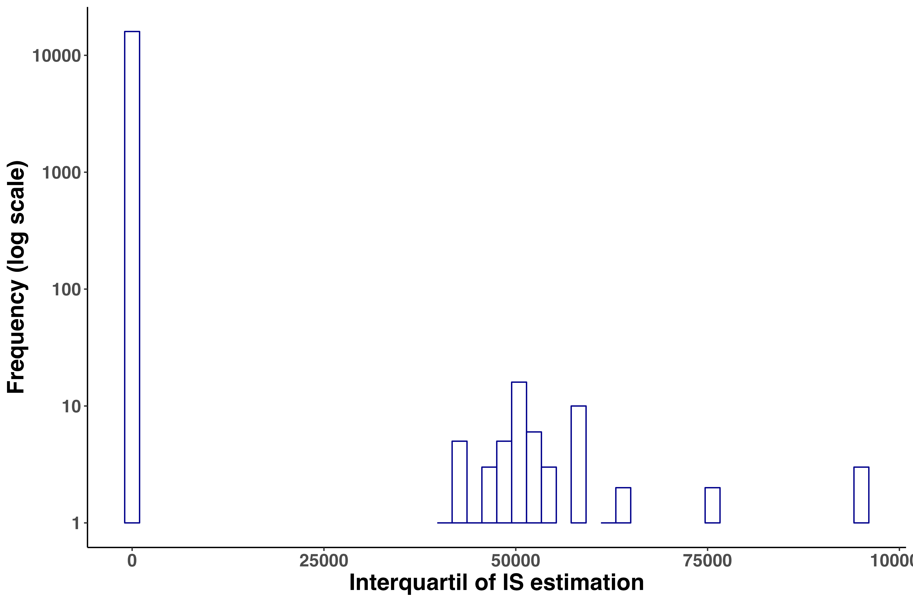

```{r setup, include=FALSE} 
knitr::opts_chunk$set(warning = FALSE, message = FALSE) 
```

## Equations for calculating species properties

### Weighted properties: Interaction Strength

We used the estimation of the interaction strength as the weighted property for the species of the Weddell Sea food web. The main equation to estimate the interaction strength $IS$ was:

$$
\begin{aligned}
IS = \alpha X_R \frac{m_R}{m_C}\\
\end{aligned}
$$
where $\alpha$ is the search rate, $X_R$ is the resource density, and $m_R$ and $m_C$ are the body mass for the resource and the consumer, respectively [@Pawar2012]. We assume the case were resources are scarce because this resembles field conditions (figure 3 e & f and equation 3 from @Pawar2012).
Then the search rate for 2D interactions (see main text) is calculated as:

$$\alpha = \alpha_{2D} m_C^{0.68 \pm 0.12}$$
For 3D interactions it is calculated as: 

$$\alpha = \alpha_{3D} m_C^{1.05 \pm 0.08}$$

where $\alpha_{2D}=10^{-3.08}$ and $\alpha_{3D}=10^{-1.77}$ are the intercepts for each interaction dimensionality.

As the resource density $X_R$ is not known for our study case we estimated it according to the equation S18 and supplementary figures 2i & j (individuals/m2 - m3) from @Pawar2012:

$$X_R = X_0 m_R^{-p_x}$$

where $p_x$ is -0.79±0.08 for 2D and -0.86±0.07 for 3D.

### Interaction Strength variability

With the aim of taking into account the variability of the exponents in $\alpha$ and $X_R$ estimations, we run 1000 simulations for calculating each pairwise predator-prey interaction. Due to the skewness nature of the estimated interaction distributions, we considered the median as the summarizing value. Such a skewness is shown in the following histogram for the interquartile range:

```{r, out.width = "12cm", echo = FALSE, fig.cap = "Frequency distribution of interquartile range for the estimated interaction strengths of the Weddell Sea food web. Total number of interactions = 16041."}


```


### Unweighted properties

As unweighted properties we calculated degree, trophic level and trophic similarity.
The degree $k$ is simply the total number of feeding links in which the species participates. It was calculated as:

$$
\begin{aligned}
L = \sum_{i=1}^{S} k_i
\end{aligned}
$$
where $L$ is the total number of feeding links for the $i^{th}$ species in the food web; here denoted as $k_i$.
The trophic level refers to a species’ vertical position in the food web, relative to the primary producers that support the community. Species that do not consume any other species in the web are primary producers or other basal resources; species with no predators are top predators; those with both predators and prey are intermediate consumers. Trophic levels $TP$ were calculated for every species based on its position in the food web using the “prey-averaged technique”:

$$
\begin{aligned}
TP_i = \frac{\sum_{j} TP_j} {n_i} +1
\end{aligned}
$$
where $n_i$ is the total number of prey taxa consumed by taxon $i$, and $TP_j$ represents the trophic position of all prey items $j$ of taxon $i$ [@Thompson2007].
The trophic similarity $TS$ between every pair of species in the food web was calculated using the following algorithm:

$$
\begin{aligned}
TS = \frac{c}{a+b+c}
\end{aligned}
$$
where $c$ is the number of predators and prey common to the two species, $a$ is the number of predators and prey unique to one species, and $b$ is the number of predators and prey unique to the other species. When the two species have the same set of predators and prey, $TS$ = 1; when the two species have no common predators or common prey, $TS$ = 0 [@Martinez1991].

Table 1 shows the mentioned properties for every species of the Weddell Sea food web.

```{r echo=FALSE, results='asis'}
library(knitr)
library(dplyr)

load("QSS_summary_sep22.rda")
knitr::kable(all_data %>% dplyr::select(TrophicSpecies, IS_mean, TotalDegree, TL, meanTrophicSimil) %>% arrange(., desc(IS_mean)), digits = c(0,7,0,2,3), col.names = c("Species","IS_mean", "Degree", "TL", "TS"), caption = "Weighted (interaction strength) and unweighted properties of the species of Weddell Sea food web. Ordered by decreasing mean interaction strength. IS_mean = mean interaction strength, TL = trophic level, TS = trophic similarity.")

```

## Extinction simulations and stability

We performed extinction simulations, one at a time, for every species in the Weddell Sea food web. In order to assess the impact on the stability of the food web we statistically compared a stability index before and after performing the extinction. For this, we applied Quasi-Sign Stability $QSS$ that calculates the proportion of matrices that are locally stable. These matrices are created by sampling the values of the community matrix (the Jacobian) from a uniform distribution, preserving the sign structure: positive for predators and negative for prey. This stability index was originally proposed by @Allesina2008.
We used the R package multiweb to calculate $QSS$ and to test the $QSS$ difference before and after performing the extinction (Saravia, 2019). Two functions were specifically created for these analyses: ‘calc_QSS’ and ‘calc_QSS_extinction_dif’.
For the $QSS$ calculation we used a uniform distribution between 0 and maximum values given by the parameters negative, positive and self-damping, corresponding to the sign of interactions and self-limitation effect. Since we had estimated the interaction strength for each interaction of the Weddell Sea food web, the limits of the distribution were $negative*-x$,$positive*x$, $self-damping*x$, where $x$ is the value of the strength for the interaction in question.
We performed 1000 extinction simulations for every species. Our results showed that the proportion of Jacobians that were locally stable was zero. Thus, we considered the mean maximum eigenvalue as the stability index, hereafter $QSS$. For testing the $QSS$ difference before and after the extinction we performed an Anderson-Darling test considering a p-value < 0.01 [@Scholz1987].

Table 2 summarizes the $QSS$ results for every species extinction of the Weddell Sea food web.

```{r echo=FALSE, results='asis'}
library(knitr)
library(dplyr)

load("../Results/QSS_summary_oct31.rda")
knitr::kable(all_dif %>% dplyr::select(TrophicSpecies, prop_difQSSm_pos, prop_difQSSm_neg, median_difQSS) %>% arrange(., prop_difQSSm_neg), digits = c(0,7,7,7,41), col.names = c("Species", "Prop dif QSS +", "Prop dif QSS - ", "Median difQSS relat"), caption = "Summary of Maximum eigenvalue (QSS) distribution of differences before and after performing extinction simulations in the Weddell Sea food web. Ordered by increasing proportion of positive differences. Prop dif QSS +  = Proportion of positive differences, Prop dif QSS - = Proportion of negative differences, Median difQSS relat = median of QSS differences")

```

## Interaction strength distribution

The statistical distribution that best fitted the empirical interaction strength distribution was a ‘log-Normal’ due to the skew towards weaker interactions. Table 3 shows the results for the six candidate models used.

```{r echo=FALSE, results='asis'}
library(knitr)
library(dplyr)

load("../Results/ModelFit_sim.rda")
knitr::kable(IS_fit_sim %>% arrange(., deltaAIC), digits = c(0,0,2,2), col.names = c("Model", "df", "AIC", "deltaAIC"), caption = "Model comparison for the distribution of interaction strengths of the Weddell Sea food web. Order by best fit. References: df = degrees of freedom, AIC = Akaike Information Criterion, deltaAIC = difference with best fit. Log-Normal is the best model.")

```

## References